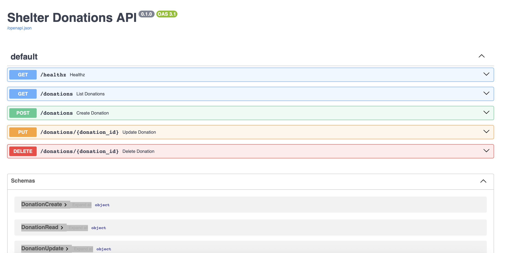
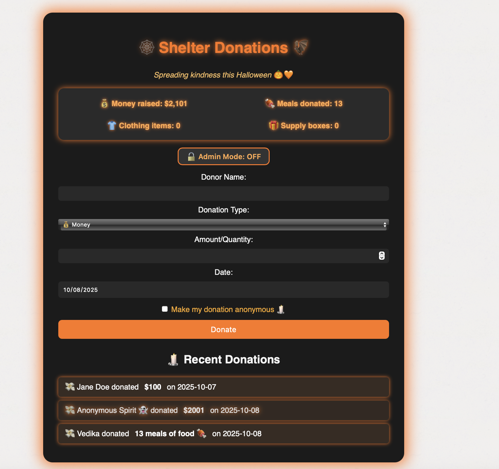

# 1. Shelter Donations — Backend (FastAPI)

This is the backend service for the **Shelter Donations** full-stack application.  
It provides RESTful APIs to create, read, update, and delete donation records for a local animal shelter.

---

## Backend Preview (Swagger API Docs)

Below is a preview of the backend API documentation served by **FastAPI Swagger UI**.



The Swagger UI provides interactive API testing for all CRUD endpoints — Create, Read, Update, Delete.

---

## Tech Stack

- **Language:** Python 3.8+
- **Framework:** FastAPI
- **ORM:** SQLAlchemy 2.x
- **Database:** SQLite (file-based)
- **Environment:** Virtual environment (`.venv`)
- **Server:** Uvicorn

---

## Setup Instructions

### 1. Clone the Repository
```bash
git clone https://github.com/<your-repo>/shelter-donations.git
cd shelter-donations
```

### 2. Create and Activate Virtual Environment

```bash
python3 -m venv .venv
source .venv/bin/activate
```

If you're on Windows, use:
```bash
.venv\Scripts\activate
```

### 3. Install Dependencies

```bash
pip install --upgrade pip
pip install -r app/requirements.txt
```

## Running the Backend

Run Uvicorn using your virtual environment’s Python executable:

```bash
./.venv/bin/python -m uvicorn app.main:app --reload --port 8000 --app-dir backend
```

Alternate (if your shell is already inside .venv and in the backend/ folder)

```bash
uvicorn app.main:app --reload --port 8000
```

## API Documentation

Once the server is running, open:

Swagger UI:

```bash
http://127.0.0.1:8000/docs
```

ReDoc:

```bash
http://127.0.0.1:8000/redoc
```

## Test the Endpoints

Example using curl:

```bash
# Create a new donation
curl -X POST http://127.0.0.1:8000/donations \
  -H "Content-Type: application/json" \
  -d '{"donor_name": "Vedika", "donation_type": "food", "amount": 10, "date": "2025-10-07"}'

# List all donations
curl http://127.0.0.1:8000/donations

# Update a donation
curl -X PUT http://127.0.0.1:8000/donations/1 \
  -H "Content-Type: application/json" \
  -d '{"amount": 25}'

# Delete a donation
curl -X DELETE http://127.0.0.1:8000/donations/1

```

# 2. Shelter Donations — Frontend (React + Vite)

This is the frontend interface for the Shelter Donations full-stack application.
It enables users to add, view, edit, and delete donations, while communicating with the FastAPI backend.

---

## Frontend Preview (Swagger API Docs)

Below is the Halloween-themed frontend interface built using React + Vite.



The interface includes a responsive layout, animated highlights, and Admin Mode for secure CRUD control.
---

## Tech Stack

Language: TypeScript
Framework: React 18 + Vite
Styling: Custom CSS (Halloween theme 🎃)
Package Manager: npm

---

## Setup Instructions

### 1. Navigate to the Frontend Folder

```bash
cd frontend
```

### 2. Install Dependencies

```bash
npm install
```

### 3. Run the Frontend

```bash
npm run dev

Frontend runs on:

http://localhost:5173
```

## Features

- Add new donations with donor name, type, amount/quantity, and date.
- Choose “Make my donation anonymous 🕯️” to hide donor identity.
- View total donations and list of all recorded donations.
- Edit or delete donations (visible only in Admin Mode).
- Halloween-themed responsive design 🎃.

## Admin Mode (Access Control)

For demo purposes, all CRUD operations are implemented.
However, Edit and Delete actions are visible only when Admin Mode is toggled on.
- Click the “🔓 Admin Mode: OFF” button to enable it.
- Once ON, ✏️ Edit and 🗑️ Delete buttons will appear.

Real-World Note

In a production deployment, edit/delete actions would be restricted via Role-Based Access Control (RBAC) —
only authenticated administrators or the original donor would have permission to modify or remove donations.

# 3. Running the Full Workflow

### Step 1: Start the Backend

From the root directory:

```bash
cd backend
source ../.venv/bin/activate
uvicorn app.main:app --reload --port 8000
```

Backend will be live at:

```bash
http://127.0.0.1:8000
```

### Step 2: Start the Frontend

Open a new terminal, then:


```bash
cd frontend
npm run dev
```

Frontend will be live at:

```bash
http://localhost:5173
```

### Step 3: Test End-to-End Workflow

1. Open http://localhost:5173 in your browser.
2. Add a new donation (e.g., name: Vedika, type: money, amount: 100).
3. Check the backend at http://127.0.0.1:8000/docs to confirm the record is stored.
4. Toggle Admin Mode to edit or delete existing donations.
5. Observe data persistence in the local SQLite database.

# 4. Data Persistence

All donation data is stored in a local SQLite database:

```bash
backend/donations.db
```

The database is automatically created on first run using:

```bash
Base.metadata.create_all(engine)
```

# 5. Security and Access Control

Current Implementation

1. All CRUD endpoints are public for demo purposes.
2. Frontend includes Admin Mode toggle to simulate restricted access.

Real Deployment

1. Use JWT authentication or OAuth2 for user login.
2. Implement Role-Based Access Control (RBAC) in FastAPI.
3. Only authenticated admins or donors can modify or delete records.

# 6. Acknowledgment

Developed as part of a Digital Aid Seattle volunteer project.

This full-stack application demonstrates:

- FastAPI + React integration
- CRUD workflow
- API persistence with SQLite
- Secure design thinking (RBAC simulation)
- UI/UX theming (Halloween Edition 🎃)